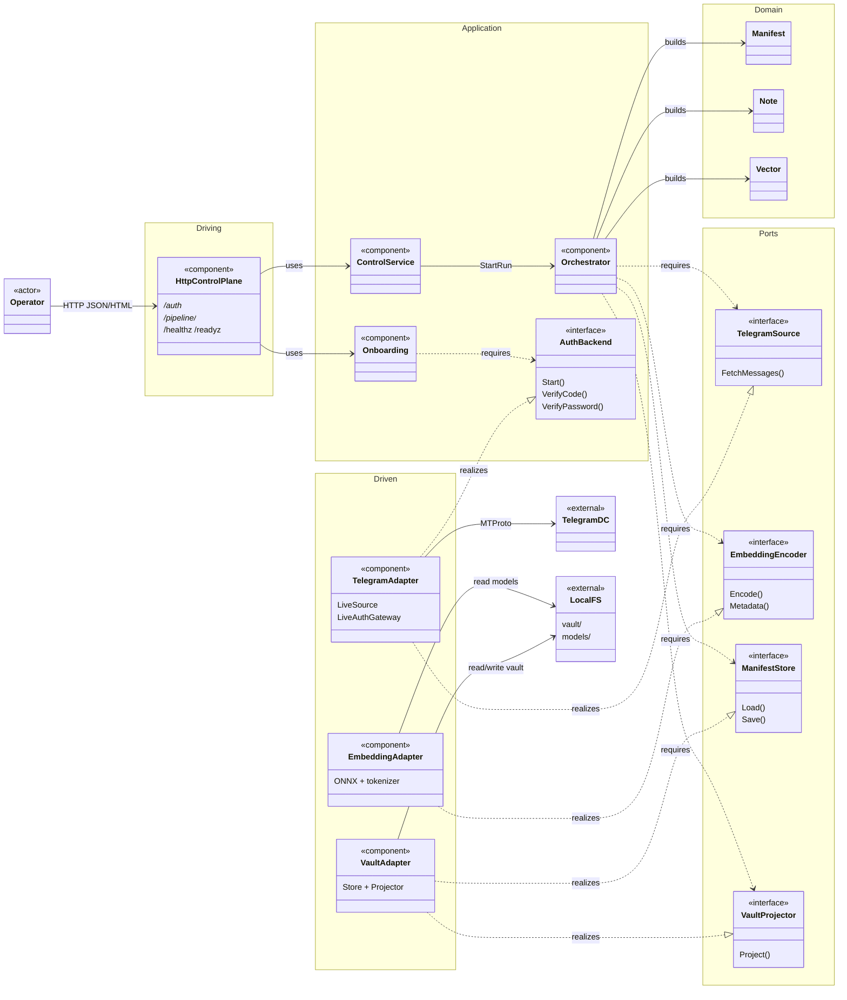
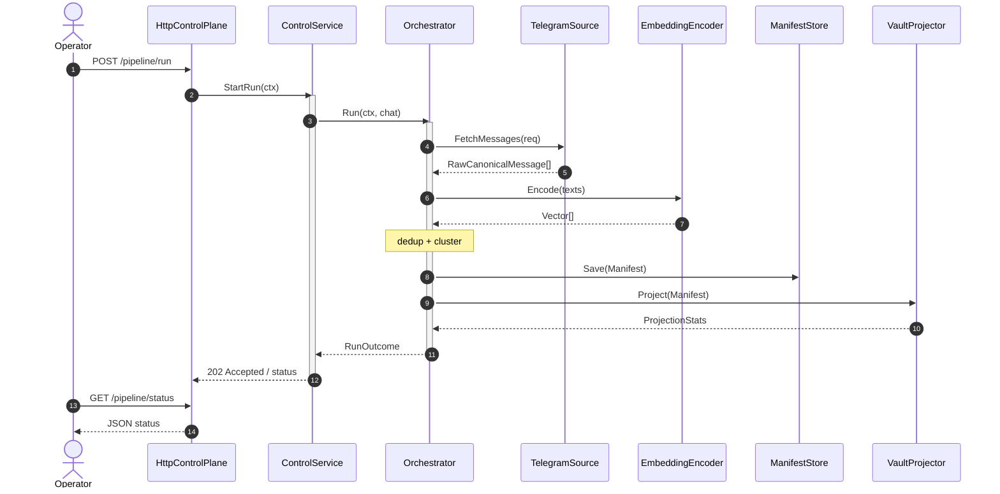

# tco

> **Warning:** Unstable and not production-ready. APIs, configuration, and vault layout can change without notice. Use at your own risk.

tco is a local Go service. It reads Telegram chat history, embeds messages with an ONNX model on the host, deduplicates and clusters them, then writes an Obsidian-compatible vault (Markdown notes plus a JSON manifest). There is no call out to an external LLM.

**Pipeline:** Telegram (MTProto) → ONNX embeddings → dedup / cluster → vault (`manifest.json` + Markdown)

## Requirements

| Item | Detail |
| :--- | :--- |
| OS | Linux `amd64` if you use `scripts/install_onnx.sh`. Elsewhere, install ONNX Runtime yourself. |
| Go | **1.26.5** |
| Tools | `git`; `curl`, `tar`, and `sh` for the install script |
| Network | Reach Telegram, or set SOCKS5 in `TELEGRAM_PROXY_ADDR` |
| Credentials | `TELEGRAM_API_ID` and `TELEGRAM_API_HASH` from [my.telegram.org](https://my.telegram.org) |
| Models | Under `./models`: `*.onnx`, `tokenizer.json` (BERT / WordPiece), `libonnxruntime.so` |

## Quick start

```bash
git clone https://github.com/flexer2006/tco.git
cd tco

bash scripts/install_onnx.sh
# Put all-MiniLM-L6-v2.onnx and tokenizer.json in ./models/ (see Model setup)

cp .env.example .env
# Set TELEGRAM_API_ID, TELEGRAM_API_HASH, TELEGRAM_CHAT_ID

go build -o bin/collector ./cmd/collector
set -a && . ./.env && set +a
./bin/collector
```

1. Open `http://127.0.0.1:8080/auth` and sign in to Telegram (login code, then 2FA if you use it).
2. Send `POST /pipeline/run` with the CSRF cookie and header. After login, the `/auth` page can send that request for you.
3. Poll `/pipeline/status`, then open `./vault`.

The control plane listens on `127.0.0.1:8080` by default. Binding outside loopback needs `ALLOW_INSECURE_BIND=1`, a long `CONTROL_PLANE_TOKEN`, and TLS cert and key files.

## Telegram credentials

1. Sign in at [my.telegram.org](https://my.telegram.org) → **API development tools** → create an application.
2. Copy `api_id` into `TELEGRAM_API_ID` and `api_hash` into `TELEGRAM_API_HASH`.
3. Set `TELEGRAM_CHAT_ID` to one of these forms:

| Format | Meaning |
| :--- | :--- |
| `@username` / `username:<name>` | Public username |
| `123456789` | Basic group chat ID |
| `-100…` | Supergroup or channel peer ID |
| `chat:<id>` | Explicit chat ID |
| `user:<id>:<access_hash>` | Private user peer |
| `channel:<id>:<access_hash>` | Channel or supergroup with access hash |

## Model setup

**ONNX Runtime (Linux amd64):**

```bash
bash scripts/install_onnx.sh
# ORT_VERSION=1.28.0 bash scripts/install_onnx.sh
```

**Default encoder profile** (`bert_tokenized_mean_pooling`): an ONNX feature-extraction model with `input_ids`, `attention_mask`, and `token_type_ids`. tco applies mean pooling and L2 normalization in process. Set `EMBED_VECTOR_DIMENSION` to the model width (384 for MiniLM-L6-v2). You also need a Hugging Face `tokenizer.json` built for WordPiece / BertWordPiece.

```bash
mkdir -p models
# Drop the ONNX file and tokenizer.json for all-MiniLM-L6-v2 into models/
# (for example a Xenova export on Hugging Face)
```

You can also export with Optimum (`optimum-cli export onnx …`). Use `EMBED_MODEL_PROFILE=string_input_direct` when the ONNX graph takes a string and returns a fixed-size vector; then you can skip `tokenizer.json`.

Set `EMBED_MODEL_PATH` and `ONNXRUNTIME_SHARED_LIBRARY` in the environment. Override `ONNX_INPUT_NAME` / `ONNX_OUTPUT_NAME` only if auto-detection fails.

## Configuration

tco reads environment variables from the process. It does not open `.env` itself. Copy `.env.example`, edit it, and export the variables before you start the binary.

| Variable | Default | Role |
| :--- | :--- | :--- |
| `TELEGRAM_API_ID` / `TELEGRAM_API_HASH` / `TELEGRAM_CHAT_ID` | — | Required |
| `HTTP_BIND` / `HTTP_PORT` | `127.0.0.1` / `8080` | Control plane address |
| `ALLOW_INSECURE_BIND` | `0` | Allow non-loopback bind (needs token + TLS) |
| `CONTROL_PLANE_TOKEN` | empty | Bearer / `X-Control-Token` when set, or when insecure bind is on |
| `CONTROL_PLANE_TLS_CERT_FILE` / `…_KEY_FILE` | empty | TLS files for the control plane |
| `VAULT_ROOT` / `MANIFEST_PATH` | `./vault` / `…/_meta/manifest.json` | Output paths |
| `TELEGRAM_SESSION_PATH` | `…/telegram.session.json` | Saved Telegram session |
| `TELEGRAM_PROXY_ADDR` | empty | Optional SOCKS5 `host:port` |
| `TELEGRAM_HISTORY_MAX_MESSAGES` | `5000` | Max messages fetched per run |
| `RUN_MODE` | `incremental` | `incremental` or `full_rebuild` |
| `BATCH_MODE` / `BATCH_SIZE` | `streaming` / `32` | How encode batches are scheduled |
| `EMBED_*` / `ONNXRUNTIME_*` | see `.env.example` | Model and runtime |
| `DEDUP_SIMILARITY_THRESHOLD` | `0.95` | Cosine dedup cutoff in `(0, 1]` |
| `CLUSTER_SIMILARITY_THRESHOLD` | `0.80` | Cosine cluster cutoff in `(0, 1]` |

## Control plane

Endpoints return JSON, except `GET /auth` (HTML). POST routes need CSRF: the `collector_csrf` cookie and `X-CSRF-Token` (or the matching form field).

| Method | Path | Purpose |
| :--- | :--- | :--- |
| `GET` | `/healthz` | Process is up |
| `GET` | `/readyz` | Ready for work (auth finished, control service up) |
| `GET` | `/auth` | Login UI |
| `GET` | `/auth/state` | Current auth state |
| `POST` | `/auth/start` | Start login (`api_id`, `api_hash`, `phone`) |
| `POST` | `/auth/verify-code` | Submit the login code |
| `POST` | `/auth/verify-password` | Cloud password (2FA) |
| `POST` | `/auth/logout` | Drop the session |
| `POST` | `/pipeline/run` | Start a run (`202`; `409` if one is already running) |
| `GET` | `/pipeline/status` | Status of the current or last run |

## Vault layout

```text
vault/
├── _meta/
│   ├── manifest.json
│   ├── embeddings/<id>.json
│   └── telegram.session.json
└── topics/<cluster>/{index.md,<note>.md}
```

Treat `manifest.json` as the source of truth for notes, clusters, model metadata, and run settings.

## Troubleshooting

| Symptom | Action |
| :--- | :--- |
| `TELEGRAM_API_*: required…` | Export `.env` into the shell before you start the binary |
| `cannot open shared object file` (onnxruntime) | Run `scripts/install_onnx.sh`, or fix `ONNXRUNTIME_SHARED_LIBRARY` |
| Model or tokenizer validation errors | Check paths, WordPiece vocab, and `EMBED_VECTOR_DIMENSION` |
| `/readyz` → `503` | Finish login at `/auth` |
| `POST /pipeline/run` → `409` | Wait until status is idle or completed |
| Chat ID parse errors | For channels and supergroups, use a `-100…` peer ID or `@username` |

## Repository layout

```text
cmd/collector/          # main
internal/adapters/      # telegram, embedding, httpcontrol, vault
internal/application/   # pipeline, onboarding, control
internal/bootstrap/     # wiring and serve loop
internal/config/        # env loading
internal/domain/        # manifest, note, vector, …
internal/ports/         # interfaces used by application
scripts/install_onnx.sh
.env.example
```

## Architecture

Hexagonal view of the `collector` binary (UML component diagram / C4 Level 3). Driving adapters sit on the left, application and ports in the middle, driven adapters on the right.

- Solid arrows: runtime calls
- Dashed arrows: interface `requires` / `realizes`
- `bootstrap` only wires the graph at startup, so it is left out of the diagram



Sequence for one pipeline run:


